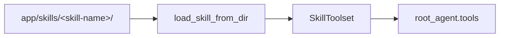

# ADK Agent 최소 참조 폴더 구조

> Workbench 없이 Python ADK로 Agent를 직접 개발하고 인계할 때 사용할 최소 구조다. 이 문서의 Skill은 coding-agent용 Skill이 아니라 실행 중인 ADK Agent가 사용하는 Custom Skill을 뜻한다.

## 1. 최소 구조

```text
my-agent/
├── README.md                         # 목적, 실행 방법, 환경 변수
├── pyproject.toml                    # Python·google-adk 의존성
├── .env.example                     # 변수 이름만 기록, secret 금지
├── app/                             # ADK가 읽는 Agent package
│   ├── __init__.py                  # root_agent 또는 app export
│   ├── agent.py                     # root_agent 정의와 Toolset 연결
│   ├── skills/                      # 선택: Agent가 사용할 Custom Skill
│   │   └── <skill-name>/
│   │       ├── SKILL.md             # 필수: metadata와 instruction
│   │       ├── references/          # 선택: 상세 지침·참조 문서
│   │       ├── assets/              # 선택: template·schema·예시 자료
│   │       └── scripts/             # 선택: Skill 실행 보조 script
│   ├── tools/                       # 선택: Function·MCP Tool 구현
│   └── schemas.py                   # 선택: 구조화 I/O model
└── tests/
    ├── test_agent_import.py         # entrypoint import 확인
    └── test_skill_loading.py        # Skill load·등록 확인
```

필수 실행 경계는 `app/agent.py`의 `root_agent`와 이를 import할 수 있는 `app/__init__.py`다. `skills/`, `tools/`, `schemas.py`는 실제 요구가 있을 때만 추가한다.

## 2. Custom Skill 위치

Custom Skill은 `agent.py`와 같은 Agent package 아래의 `skills/`에 둔다.

```text
app/
├── agent.py
└── skills/
    ├── document-review/
    │   ├── SKILL.md
    │   └── references/
    │       └── review-policy.md
    └── report-writing/
        ├── SKILL.md
        ├── assets/
        │   └── report-template.md
        └── scripts/
            └── validate_report.py
```

배치 기준은 다음과 같다.

- Skill 하나당 directory 하나와 `SKILL.md` 하나를 둔다.
- `SKILL.md` frontmatter에는 Agent가 Skill을 발견할 수 있는 `name`과 `description`을 기록한다.
- 긴 설명은 `references/`, 입력 template이나 schema는 `assets/`, 실행 보조 코드는 `scripts/`에 둔다.
- Agent runtime용 Skill을 repository의 `.agents/skills/`에 두지 않는다. 그 위치는 coding agent용이며 ADK Agent가 자동으로 읽지 않는다.
- directory만 만들면 활성화되지 않는다. `agent.py`에서 Skill을 load하고 `SkillToolset`을 Agent의 `tools`에 등록해야 한다.
- `scripts/`를 실행하려면 `SkillToolset` 또는 Agent에 `code_executor`를 별도로 구성한다.

## 3. Agent 연결



최소 연결 예시는 다음과 같다.

```python
from pathlib import Path

from google.adk import Agent
from google.adk.skills import load_skill_from_dir
from google.adk.tools import skill_toolset


skill_root = Path(__file__).parent / "skills"
document_review = load_skill_from_dir(skill_root / "document-review")

custom_skills = skill_toolset.SkillToolset(
    skills=[document_review],
)

root_agent = Agent(
    name="document_agent",
    model="<reviewed-model>",
    instruction="Use an appropriate Skill when the request matches it.",
    tools=[custom_skills],
)
```

`app/__init__.py`는 최소한 다음 entrypoint를 export한다.

```python
from .agent import root_agent
```

## 4. 최소 확인 항목

- `pyproject.toml`에 실제 검증한 `google-adk` version 범위를 고정한다.
- `app` package와 `root_agent`가 import된다.
- 모든 Skill directory에 유효한 `SKILL.md`가 있다.
- 등록한 Skill만 `SkillToolset`에 포함된다.
- Skill의 참조 파일과 script path가 해당 Skill directory 기준 상대 경로로 해석된다.
- secret이나 실제 고객 데이터가 Skill·sample·`.env.example`에 포함되지 않는다.

ADK Agent Skills는 현재 experimental 기능이다. Python은 ADK v1.25.0 이상에서 지원되며, 이 저장소의 확인 환경은 `google-adk 2.3.0`이다. 상세 형식과 API는 [공식 ADK Skills 문서](https://adk.dev/skills/)를 기준으로 확인한다.
