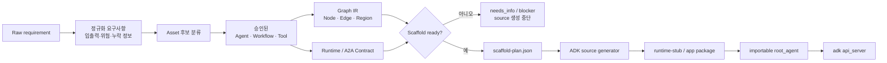
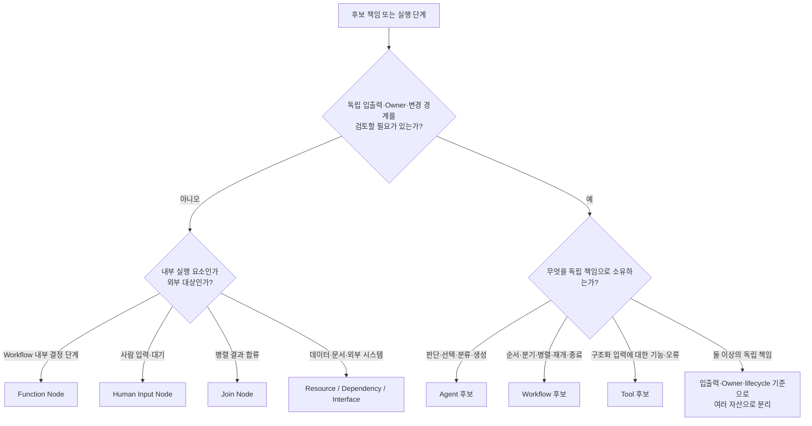
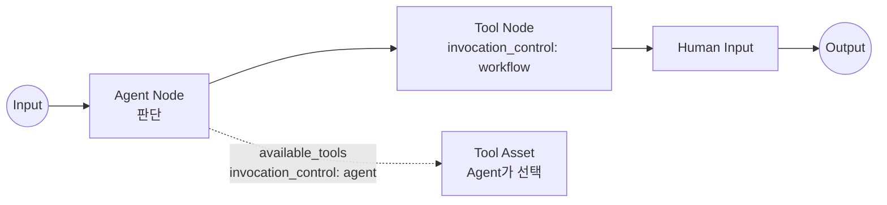
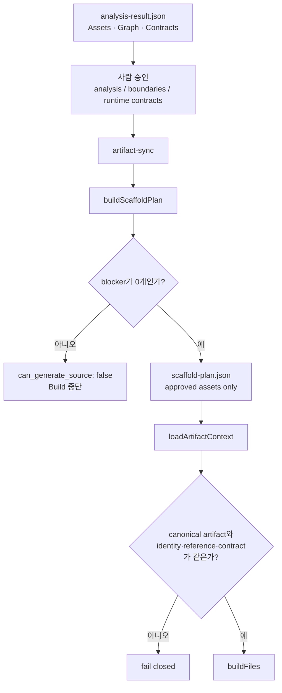
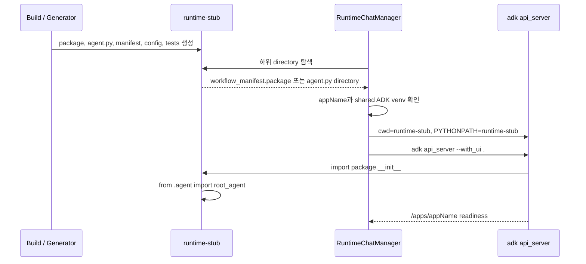

# Agent(Workflow) 개발 표준

> 이 문서는 Agent Factory를 사용해 설계한 Agent와 Workflow가 어떤 기준으로 분류되고, 어떻게 하나의 실행 Graph와 ADK server app 단위로 조합되는지를 설명하는 개발 표준이다. Agent Factory 사용 자체를 강제하지는 않는다. 다른 방식으로 개발하더라도 이 문서의 논리적 책임, 계약, 실행 단위 정보를 동등하게 제공해야 한다.

이 문서는 새로운 자산 유형이나 Graph enum을 정의하지 않는다. 자산 분류의 단일 기준은 [Taxonomy](../workbench/taxonomy.md), Node·Edge와 Invocation Control의 단일 기준은 [Graph IR](../workbench/graph-ir.md), 승인과 Runtime Handoff 흐름의 단일 기준은 [Operating Model](../workbench/operating-model.md)이다.

## 1. 목적

개발 표준의 목표는 구현자가 달라도 다음 질문에 같은 방식으로 답할 수 있게 하는 것이다.

1. 무엇을 독립 Agent, Workflow, Tool로 개발했는가?
2. 각 자산은 어떤 판단, 흐름, 기능 책임을 소유하는가?
3. 자산은 Graph에서 어떤 Node로 배치되고 누가 Tool 호출을 결정하는가?
4. 어떤 Runtime Contract가 있어야 source를 생성할 수 있는가?
5. 생성된 source 중 무엇이 ADK server가 읽는 하나의 app 단위인가?
6. 코드와 설정의 어느 위치에서 위 판단을 다시 확인할 수 있는가?

이 표준이 강제하는 것은 특정 코드 생성기가 아니라 **설명 가능한 책임 분리, 검토 가능한 실행 구조, import 가능한 단일 `root_agent` 경계**다.

## 2. 전체 변환 흐름

Agent Factory의 현재 기준 흐름은 raw requirement를 즉시 source code로 바꾸지 않는다. 정규화, 자산 분류, Graph와 계약 검토, 사람 승인을 먼저 거친다.



핵심 경계는 다음과 같다.

- Requirement는 분석 입력이지 code generation 입력이 아니다.
- `analysis-result.json`이 승인된 자산, Graph, Runtime/A2A Contract의 canonical 의미를 소유한다.
- `scaffold-plan.json`은 승인된 설계를 source 생성 입력으로 고정한다.
- `runtime-stub/`은 하나의 ADK app을 import하고 실행하기 위한 Runtime Handoff bundle이다.
- ADK가 최종적으로 읽는 진입점은 Python package가 export하는 `root_agent`다.

## 3. 자산 분류 기준

### 3.1 먼저 독립 자산인지 판단한다

모든 단계나 함수가 Agent, Workflow, Tool이 되는 것은 아니다. 먼저 독립적인 검토·변경·재사용 계약을 가져야 하는지 판단한다.



독립 자산 경계를 만드는 실무 신호는 다음과 같다.

- 별도 입력·출력 계약과 버전이 필요하다.
- 변경 또는 품질 책임 Owner가 다르다.
- 독립 실패, 재시도, 감사 또는 보안 경계를 갖는다.
- 다른 Workflow에서 재사용하거나 Catalog에서 발견할 가치가 있다.
- 별도 배포·원격 호출 경계를 검토해야 한다.

이 신호가 없고 하나의 Workflow 안에서만 의미가 있다면 Graph 내부 Node나 private code로 유지한다.

### 3.2 책임에 따라 Agent, Workflow, Tool을 구분한다

| 판정 질문 | 선택하는 자산 | 설계에서 반드시 드러낼 내용 |
| --- | --- | --- |
| 입력을 해석해 독립적인 판단·선택·분류·요약·추천·생성을 수행하는가? | Agent | 판단 범위, 입력, 출력, Model/Prompt 경계, 사용 가능한 Tool, 품질 기준 |
| 둘 이상의 실행 단위를 연결하고 순서·분기·병렬·반복·사용자 입력·중단과 재개·종료를 소유하는가? | Workflow | Graph, 시작·종료, 분기 조건, 병렬·합류, 실패 경로, 하위 자산 호출 |
| 명확한 입력 계약으로 특정 기능을 수행하고 구조화된 결과 또는 오류를 반환하는가? | Tool | 입력·출력 Schema, 오류, Side Effect, Binding, Transport |

다음 항목은 자산 유형이 아니라 별도 축이다.

- `MCP`는 Tool의 Binding이다.
- `A2A`는 Agent의 원격 호출 또는 노출 경계다.
- `function`, `in_process`, `stdio`, `http`는 Binding 또는 Transport를 설명한다.
- Domain, Owner, 재사용 상태, Coordinator·Worker 같은 역할명은 자산 유형을 늘리지 않는다.

### 3.3 분류 결과에 붙는 공통 메타데이터

자산 유형을 정한 뒤 다음 정보를 분리해 기록한다.

| 축 | 답해야 하는 질문 |
| --- | --- |
| I/O Contract | 어떤 구조를 받고 어떤 결과 또는 오류를 반환하는가? |
| Ownership | 변경·운영·품질 책임 팀은 누구인가? |
| Business Context | 어느 Domain에 적용되는가? |
| Reuse | 기존 자산 재사용인가, 현재 프로젝트 전용인가, publish 후보인가? |
| Binding | Function, MCP, A2A 등 어떤 방식으로 구현과 연결되는가? |
| Transport | in-process, stdio, HTTP 등 어떤 경로로 호출되는가? |
| Risk | Side Effect, 외부 메시지, 사람 승인, 개인정보·감사 경계가 있는가? |

## 4. 자산을 Workflow Graph로 조합하는 기준

자산 분류는 “무엇이 존재하는가”를 설명하고 Graph IR은 “이번 app이 무엇을 어떤 순서로 실행하는가”를 설명한다. 자산과 Graph Node를 같은 분류 체계로 취급하지 않는다.

### 4.1 자산과 Node의 연결

| Graph 위치 | 연결 대상 | 의미 |
| --- | --- | --- |
| Agent Node | `agent_ref`로 Agent 자산 참조 | 독립 판단 책임 실행 |
| Tool Node | `tool_ref`로 Tool 자산 참조 | Workflow가 Tool 실행을 명시적으로 결정 |
| Subworkflow Node | `workflow_ref`로 Workflow 자산 참조 | 검토된 하위 Workflow 호출 경계 |
| Function Node | 부모 Workflow 내부 code | 독립 자산이 아닌 결정적 처리 단계 |
| Human Input Node | 입력·승인·선택 계약 | 실행 중단과 같은 문맥의 재개 지점 |
| Join Node | Graph 제어 | 둘 이상의 upstream 결과 합류 |
| Input / Output Node | app 경계 | 시작 입력과 terminal 결과 |

Graph root의 `workflow_ref`는 Graph 전체를 소유하는 Workflow 자산을 가리킨다. 독립 Agent 또는 Tool만으로 구성한 standalone Graph라면 `workflow_ref`는 `null`이고, generator는 이를 실행 가능한 root Workflow wrapper로 낮춘다.

### 4.2 Tool 호출 결정권을 구분한다

같은 Tool이라도 호출 여부를 누가 결정하는지에 따라 wiring이 달라진다.



- **Workflow 호출**: Tool이 Graph의 Tool Node로 존재한다. Edge가 해당 Node에 도달하면 Workflow가 Tool을 실행한다.
- **Agent 선택**: Tool은 Agent Node의 `available_tools`에 연결된다. Agent가 현재 문맥에서 사용 여부를 판단한다.
- Model 또는 LLM 자체를 Invocation Control Owner로 기록하지 않는다. 판단 책임을 소유한 Agent가 Owner다.

Current Implementation에서 Agent-owned HTTP MCP Tool은 ADK `McpToolset`으로 연결되며, 검토된 정확한 `tool_name`만 filter에 포함된다. Workflow-owned MCP Tool Node는 같은 `tool_name`을 결정적으로 직접 호출한다. 같은 MCP server가 다른 Tool을 제공해도 자동으로 호출 범위에 포함하지 않는다.

### 4.3 Graph 완결 조건

Runnable source를 만들기 전에 다음 조건을 확인한다.

- Node ID와 Edge ID가 중복되지 않는다.
- 모든 Edge의 `from`과 `to`가 실제 Node를 가리킨다.
- Agent·Tool·Subworkflow 참조가 올바른 자산 유형을 가리킨다.
- 시작점에서 필요한 실행 Node와 terminal Output까지 도달할 수 있다.
- 조건 분기에는 검토된 값, alias, default가 있다.
- 병렬 경로는 명시적 Join과 결과 합류 계약을 가진다.
- Human Input, write Side Effect, 외부 메시지, MCP/A2A 경계에 필요한 Runtime Contract가 있다.
- Workflow의 `representation`이 `graph`인지 `dynamic`인지 검토되어 있다.

### 4.4 ADK app의 root를 정한다

ADK server에 올릴 단위는 “Agent 파일의 개수”가 아니라 하나의 `root_agent`가 소유하는 실행 Graph다.

| 설계 상황 | app root 선택 |
| --- | --- |
| 하나의 Agent가 입력을 판단하고 결과를 반환한다 | standalone Graph로 두고 generator가 root Workflow wrapper를 만든다. |
| 여러 Agent·Tool·Function의 순서와 분기를 조정한다 | 그 흐름을 소유하는 Workflow 자산을 Graph root의 `workflow_ref`로 둔다. |
| 검토된 기존 Workflow를 일부 단계에서 호출한다 | 부모 Graph에 Subworkflow Node 하나를 두고 하위 Workflow 내부 Node를 복제하지 않는다. |
| Owner·lifecycle·원격 경계가 독립된 Agent를 호출한다 | 같은 package에 합치지 않고 Agent 자산의 A2A Binding으로 연결한다. |
| 서로 독립적인 두 Workflow를 제공해야 한다 | 별도 serving unit으로 나누거나 둘을 소유하는 상위 Workflow를 명시적으로 설계한다. 한 package에 `root_agent`를 여러 개 두지 않는다. |

따라서 하나의 ADK app을 만들기 전에 다음 문장이 완성되어야 한다.

> 이 app의 `root_agent`는 **어떤 Workflow 또는 standalone 책임**을 소유하며, **어떤 Agent·Tool·Subworkflow**를 **어떤 Graph 경로**로 실행한다.

## 5. 승인된 설계에서 Scaffold Plan을 만드는 기준

`scaffold-plan.json`은 설계 문서의 복사본이 아니라 source generation을 위한 승인 projection이다.



Scaffold Plan은 최소한 다음 불변식을 갖는다.

- `contract_version: "2.0"`
- `source: approved_workbench_artifact`
- `raw_requirement_to_code: false`
- approved 상태인 자산만 `assets`에 포함
- 승인된 Graph와 Runtime Contract를 그대로 사용
- 제외된 자산과 새 구현이 필요한 자산을 분리
- blocker가 있으면 `validation.can_generate_source: false`
- `output_mode`는 `smoke` 또는 `runnable`

Generator는 다시 다음을 검사한다.

- `analysis-result.json`, `scaffold-plan.json`, `af-run-manifest.json`이 모두 존재하고 strict schema를 통과하는가?
- requirement ID와 source requirement ID가 일치하는가?
- Scaffold의 Asset·Graph·Runtime Contract가 canonical analysis와 drift하지 않았는가?
- Analyze와 두 Design approval이 true이고 Design stage가 complete인가?
- 필요한 Runtime/A2A Contract가 승인되었는가?
- MCP transport, Graph control, async resume 같은 선택 기능을 현재 lowerer가 실제 지원하는가?

이 중 하나라도 실패하면 generator는 추정값이나 compatibility 변환을 만들지 않고 source 생성 전에 중단한다.

## 6. Graph를 ADK source로 낮추는 기준

### 6.1 Output mode

| Mode | 생성 목적 | `root_agent` |
| --- | --- | --- |
| `smoke` | 승인된 자산과 Graph wiring을 합성 입력으로 확인하는 test double | `SyntheticRuntimeSmokeAgent` |
| `runnable` | 지원되는 Graph 의미를 실제 ADK Workflow로 실행하는 local handoff | `Workflow` 또는 async-resume 지원 subclass |

`smoke`는 실제 업무 로직을 구현했다는 뜻이 아니다. `runnable`도 지원되는 검토 계약만 낮추며 지원하지 않는 control이나 연결을 임의 코드로 보완하지 않는다.

### 6.2 Static Graph와 Dynamic Workflow

Runnable mode에서 Graph를 소유한 Workflow의 `workflow_profile.representation`이 lowering 방식을 결정한다.

- `graph`: 검토된 acyclic Node·Edge를 ADK `Workflow(edges=[...])`로 구성한다.
- `dynamic`: 검토된 실행 순서를 `@node` 기반 `dynamic_workflow` 함수로 만들고 root Workflow가 그 Node를 시작한다.
- `unresolved`: source 생성을 중단한다.
- standalone Graph는 기본적으로 `graph` representation으로 처리한다.

현재 Dynamic lowering도 무제한 실행을 의미하지 않는다. 승인된 bound/exhaustion 계약을 표현할 수 없는 loop, 지원하지 않는 callback·retry·fallback·resume 계열 control은 fail-closed 대상이다.

### 6.3 Node별 ADK lowering

| 설계 요소 | Current runnable lowering |
| --- | --- |
| Local Agent Node | `LlmAgent` 선언과 검토된 instruction/model 설정 |
| A2A Agent Node | 승인된 계약을 사용하는 `RemoteA2aAgent` |
| Workflow-owned Tool Node | 결정적 callable Node. HTTP MCP 연결이면 exact reviewed Tool 직접 호출 |
| Agent-owned MCP Tool | Agent의 `McpToolset`에 exact `tool_name` allow-list로 연결 |
| Function Node | ADK `FunctionNode`로 실행되는 private deterministic function |
| Human Input Node | `RequestInput` 기반 입력 대기. 구조화 resume는 승인된 async-resume contract가 있을 때만 생성 |
| Join Node | ADK `JoinNode` |
| Subworkflow Node | 별도 Workflow 계약 호출 경계. 미구현 업무 로직은 handoff placeholder로 유지 |
| Output Node | terminal output event와 결과 수집 경계 |

Graph Node 하나가 곧 Python 파일 하나가 되는 것은 아니다. Generator는 Node 종류와 asset reference를 수집한 뒤 필요한 declaration과 callable을 `agent.py`에 조합하고, 지원 문서·설정·test 파일을 함께 만든다.

## 7. ADK server에 올라가는 실행 단위

### 7.1 실행 단위 정의

이 프로젝트의 참조 실행 단위는 다음 식으로 정의한다.

```text
ADK Serving Unit
  = runtime-stub directory
  + import 가능한 Python app package 1개
  + package가 export하는 root_agent 1개
  + workflow_manifest와 실행 설정·test·handoff 자료
```

하나의 bundle에 여러 app package를 섞지 않는 것을 표준으로 한다. 현재 app discovery는 `runtime-stub/` 아래 directory를 탐색하므로 여러 app이 있으면 탐색 순서에 따라 모호해질 수 있다.

### 7.2 참조 폴더 구조

Workbench와 무관한 ADK 단독 프로젝트 구조와 runtime Custom Skill 위치는 [ADK Agent 최소 참조 폴더 구조](./adk-agent-folder-structure.md)에서 확인한다.

```text
artifacts/af/<requirement-id>/runtime-stub/
├── README.md
├── scaffold-plan.json
├── implementation-handoff.md
├── runtime-chat-smoke.json
├── agents.config.yaml                 # runnable mode
├── .env.example                       # runnable mode, secret 값 없음
├── <package-name>/
│   ├── __init__.py                    # from .agent import root_agent
│   ├── agent.py                       # executable root_agent 정의
│   ├── workflow.py                    # 안정적인 Workflow import/handoff 위치
│   ├── schemas.py                     # reviewed I/O contract projection
│   ├── workflow_manifest.json         # package·asset·Graph·runtime metadata
│   ├── mock_config.yaml
│   ├── sample_inputs.yaml
│   ├── nodes/
│   │   ├── agents.py
│   │   ├── tools.py
│   │   ├── functions.py
│   │   ├── gates.py
│   │   ├── human_inputs.py
│   │   └── subworkflows.py
│   └── tests/
│       └── test_workflow_contract.py
├── af_adk_a2a_server.py               # 승인된 A2A exposure가 있을 때만
└── <package-name>/agent.json           # 승인된 A2A exposure가 있을 때만
```

`package_name`이 Scaffold Plan에 명시되면 유효한 Python package identifier여야 한다. 생략하면 normalized requirement ID를 Python identifier로 바꾸고 `_adk` suffix를 붙인다.

### 7.3 `root_agent` 조립

Runnable static Graph의 핵심 결과는 개념적으로 다음 형태다.

```python
from google.adk.workflow import START, Workflow

# Graph IR에서 lower한 Agent, Tool, Function, Human Input, Join 선언

root_agent = Workflow(
    name="<package-name>",
    description="승인된 설계에서 생성한 Workflow",
    edges=[
        (START, first_node),
        (first_node, next_node),
        # reviewed Graph IR에서 lower한 edge
    ],
)
```

Dynamic representation은 `dynamic_workflow` Node를 만들고 `(START, dynamic_workflow)`를 root edge로 둔다. 두 경우 모두 ADK server가 찾는 app entrypoint는 동일하게 `root_agent`다.

### 7.4 Package 발견과 서버 기동



Current Workbench의 실제 local command shape는 다음과 같다.

```bash
adk api_server \
  --host 127.0.0.1 \
  --port 8765 \
  --session_service_uri memory:// \
  --artifact_service_uri memory:// \
  --no-reload \
  --with_ui \
  .
```

기동 시 중요한 조건은 다음과 같다.

- process의 working directory는 `runtime-stub/`이다.
- `PYTHONPATH`에도 같은 `runtime-stub/` 경로를 넣는다.
- app discovery는 package directory의 `workflow_manifest.json.package`를 우선 사용하고, 없으면 `agent.py`가 있는 directory 이름을 사용한다.
- package `__init__.py`가 `agent.py`의 `root_agent`를 export한다.
- runtime 환경 변수는 기본적으로 repository의 `.agent-factory/runtime.env`에서 읽고 실제 secret은 generated source에 넣지 않는다.
- source를 재생성하면 실행 중 bundle과 현재 bundle의 fingerprint가 달라질 수 있으므로 새 source를 읽으려면 process를 다시 시작한다.

승인된 A2A Exposure가 있는 Agent는 같은 package에 `agent.json`을 추가하고 별도 `af_adk_a2a_server.py` launcher를 생성한다. 이것은 일반 ADK chat app의 자산 유형을 바꾸는 것이 아니라 동일 Agent를 A2A provider로 노출하는 조건부 protocol surface다.

## 8. Workbench를 사용하지 않는 구현의 동등 기준

개발자가 Workbench 없이 직접 Agent를 구현해도 다음 정보를 제공하면 이 표준과 동등한 구조로 검토할 수 있다.

1. Agent·Workflow·Tool 목록과 각 책임, Owner, I/O Contract
2. Workflow Graph 또는 동등한 실행 구조 문서
3. Tool별 Invocation Control, Binding, Transport
4. 사람 입력, Side Effect, 외부 연결에 대한 Runtime Contract
5. 하나의 app package와 하나의 import 가능한 `root_agent`
6. package name, entrypoint, asset/Graph 정보를 설명하는 manifest 또는 README
7. model, prompt, Tool 연결을 code와 분리한 설정 위치
8. import·contract·local smoke를 반복할 수 있는 test와 sample input

파일명이 Workbench Runtime Handoff와 정확히 같을 필요는 없다. 다만 README에서 위 정보의 실제 위치를 명시해 인수자가 탐색 없이 찾을 수 있어야 한다.

## 9. 개발 완료 체크리스트

### 분류

- [ ] 독립 자산과 Workflow 내부 Node를 구분했다.
- [ ] Agent는 판단, Workflow는 흐름, Tool은 기능 계약을 소유한다.
- [ ] MCP와 A2A를 자산 유형으로 만들지 않았다.
- [ ] Domain, Owner, 재사용 상태, Binding, Transport를 별도 축으로 기록했다.

### 조합

- [ ] Graph root의 Workflow ownership 또는 standalone 상태가 명확하다.
- [ ] 모든 asset ref와 Node·Edge ref가 유효하다.
- [ ] Tool Invocation Control이 Workflow 또는 Agent로 명확하다.
- [ ] 시작, 분기, Human Input, Join, 실패, terminal output을 설명할 수 있다.
- [ ] 선택한 `graph` 또는 `dynamic` representation이 실제 실행 의미와 일치한다.

### 생성

- [ ] source는 raw requirement가 아니라 승인된 설계 artifact 또는 동등한 reviewed contract에서 생성했다.
- [ ] unresolved information과 blocker가 남아 있지 않다.
- [ ] 필요한 Runtime/A2A Contract가 승인되어 있다.
- [ ] unsupported Graph control이나 protocol을 추정 구현하지 않고 fail-closed 처리했다.

### ADK app 단위

- [ ] `runtime-stub/` 또는 동등한 serving root에 app package가 하나만 있다.
- [ ] package name, directory, manifest, `root_agent.name`이 일관된다.
- [ ] package가 import 가능한 `root_agent`를 export한다.
- [ ] server working directory와 `PYTHONPATH`가 serving root를 가리킨다.
- [ ] compile/import, contract test, sample smoke를 반복 실행할 수 있다.

## 10. Current source locators

아래는 이 문서의 Current Implementation 설명을 확인한 탐색점이다. path와 symbol은 현재 source에서 다시 확인해야 한다.

| 행동 | Source locator |
| --- | --- |
| Scaffold Plan 생성과 blocker | [`packages/web/src/analyzer/scaffoldPlan.ts`](../../packages/web/src/analyzer/scaffoldPlan.ts) · `buildScaffoldPlan` |
| canonical artifact 동기화 | [`packages/web/server/artifactSync.ts`](../../packages/web/server/artifactSync.ts) · `syncArtifactRoot` |
| generator 입력·approval·parity gate | [`scripts/adk-source/context.mjs`](../../scripts/adk-source/context.mjs) · `loadArtifactContext`, `validateRunInputs` |
| static/dynamic representation 선택 | [`scripts/adk-source/graph/dynamic.mjs`](../../scripts/adk-source/graph/dynamic.mjs) · `runnableWorkflowRepresentation` |
| runnable root Workflow 생성 | [`scripts/adk-source/agent-runnable.mjs`](../../scripts/adk-source/agent-runnable.mjs) · `buildRunnableAgentPy` |
| dynamic root Workflow 생성 | [`scripts/adk-source/agent-dynamic.mjs`](../../scripts/adk-source/agent-dynamic.mjs) · `buildDynamicRunnableAgentPy` |
| smoke root Agent 생성 | [`scripts/adk-source/agent-smoke.mjs`](../../scripts/adk-source/agent-smoke.mjs) · `buildSmokeAgentPy` |
| package와 지원 파일 조립 | [`scripts/adk-source/file-builder.mjs`](../../scripts/adk-source/file-builder.mjs) · `buildFiles` |
| ADK app 발견과 server command | [`packages/web/server/runtimeChat.ts`](../../packages/web/server/runtimeChat.ts) · `discoverAppName`, `buildAdkServerCommand` |
| runtime env와 `PYTHONPATH` | [`packages/web/server/runtimeEnv.ts`](../../packages/web/server/runtimeEnv.ts) · `buildRuntimeProcessEnv` |

## 11. 함께 읽을 문서

- [Agent Factory 자산 Taxonomy](../workbench/taxonomy.md)
- [Workflow Graph IR](../workbench/graph-ir.md)
- [Operating Model](../workbench/operating-model.md)
- [Runtime Handoff Build](../handbook/stages/runtime-handoff-build.md)
- [Runtime Execution](../handbook/stages/runtime-execution.md)
- [Validation](../workbench/validation.md)
- [ADK Agent Execution Modes](../workbench/adk-agent-execution-modes.md)
