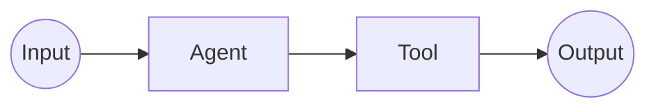
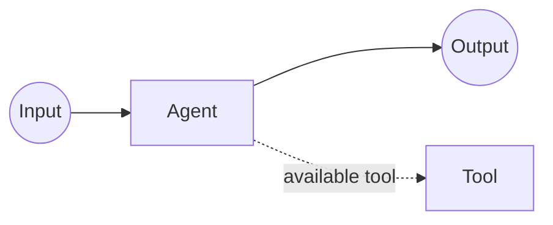
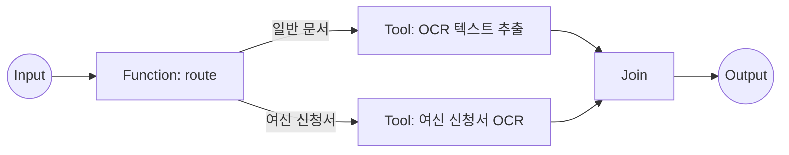

# Agent Factory 그래프 중간 표현(Graph IR)

> 이 문서는 strict Target Contract v2의 Graph IR 단일 기준이다. 현재 Product 구현도 이 shape만 읽고 쓴다. 과거 결정과 제거된 입력은 [Taxonomy Migration Status](../migration/taxonomy-vnext-status.md)에서 확인한다.

Graph IR은 Workflow 실행 구조를 표현한다. 재사용 자산의 종류와 업무·소유·재사용 속성은 [Taxonomy](taxonomy.md), 단계·승인·artifact 흐름은 [Operating Model](operating-model.md)이 소유한다.

## 카탈로그(Catalog) 자산과 그래프 노드(Graph Node)

Catalog 자산과 Graph Node는 경쟁하는 분류 체계가 아니다.

| Graph 표현 | 참조 또는 소유 대상 | 의미 |
| --- | --- | --- |
| Agent Node | Agent 자산 | 독립 판단 책임을 실행한다. |
| Tool Node | Tool 자산 | Workflow가 검토된 Tool을 명시 호출한다. |
| Subworkflow Node | Workflow 자산 | 검토된 하위 Workflow를 호출한다. |
| Function Node | 부모 Workflow 내부 구현 | 해당 Workflow에만 속한 결정적 단계를 실행한다. |
| Human Input Node | 사용자 입력 계약 | 입력·승인·선택을 기다리고 실행을 중단·재개한다. |
| Join Node | Graph 제어 | 여러 upstream 결과를 fan-in 한다. |

Node의 존재만으로 Catalog 자산이 생기지 않는다. `agent_ref`, `tool_ref`, `workflow_ref`만 Agent, Tool, Workflow 자산을 참조한다.

## Graph envelope

모든 Graph는 다음 여섯 필드를 정확히 갖는다.

```yaml
graph_id: graph.loan-document-review
source_requirement_id: req-loan-document-review
workflow_ref: workflow.loan-document-review
nodes: []
edges: []
regions: []
```

`workflow_ref`는 Graph 전체를 소유하는 Workflow 자산 참조다. 검토된 해가 standalone Agent 또는 Tool이면 반드시 `null`이다. Subworkflow Node의 `workflow_ref`와 Graph root의 `workflow_ref`를 혼동하지 않는다.

## 권장 Node 종류

`node_kind`는 다음 여덟 값만 허용한다.

| 표시명 | 직렬화 | 필수 계약 |
| --- | --- | --- |
| Input/Start | `input` | `id`, `label`, `node_kind` |
| Agent Node | `agent` | `agent_ref`, `available_tools` |
| Tool Node | `tool` | `tool_ref`, `invocation_control: workflow` |
| Function Node | `function` | `role` |
| Human Input Node | `human_input` | `human_input_contract` |
| Subworkflow Node | `subworkflow` | `workflow_ref` |
| Join Node | `join` | `id`, `label`, `node_kind` |
| Output/End | `output` | `id`, `label`, `node_kind` |

각 Node variant는 정의된 필드 외 추가 필드를 허용하지 않는다. Function `role`은 `transform`, `validate`, `route`, `merge`, `prepare_input`, `format_output` 중 하나다.

## Function Node

Function Node는 하나의 Workflow 내부에서 Graph가 해당 지점에 도달하면 결정적으로 실행되는 private 코드 단계다. 부모 Workflow의 Domain과 Owner를 상속하며 독립 Catalog 자산이 아니다.

아래 중 하나 이상이 있을 때 독립 Node로 드러낸다.

1. 독립 입출력 경계가 있다.
2. 개별 실패·재시도 추적이 필요하다.
3. 분기 또는 Join의 기준점이다.
4. 중단·재개 체크포인트다.
5. 감사상 독립 단계로 남아야 한다.
6. 업무 설명에서 독립 단계로 표현할 의미가 있다.

작은 문자열 helper처럼 독립 실행 경계가 없는 코드는 Node로 만들지 않는다.

## Tool Node

Tool Node는 Tool 자산을 Workflow가 명시적으로 호출하는 실행 단계다.

```yaml
id: node.ocr
label: OCR 텍스트 추출
node_kind: tool
tool_ref: tool.ocr-text-extraction
invocation_control: workflow
```

Binding과 Transport는 참조한 Tool 자산이 소유한다. Tool Node에 복제하지 않는다.

## Function Node, Tool Node, Function Tool 구분

Function Node는 Workflow 내부 단계이고 Tool Node는 독립 Tool 자산의 Graph 호출이다. Function binding을 가진 Tool도 Tool 자산이다.

```text
같은 함수
├── Workflow 내부 단계로 직접 실행 → Function Node
├── Tool 계약으로 등록하고 Workflow가 명시 호출 → Tool Node + Function binding
└── Agent가 사용 여부를 판단 → Agent available_tools + Function binding Tool
```

| 구분 | Function Node | Tool Node | Agent available Tool |
| --- | --- | --- | --- |
| Catalog 자산 | 아니오 | Tool 참조 | Tool 참조 |
| 실행 결정 | Graph 도달 | Workflow 명시 호출 | Agent 판단 |
| Owner | 부모 Workflow 상속 | Tool Owner | Tool Owner |

## Tool Invocation Control

Invocation Control 값은 `workflow`, `agent` 둘뿐이다.

| 표시명 | 직렬화 위치 | 의미 |
| --- | --- | --- |
| Workflow | Tool Node의 `invocation_control: workflow` | 명시적 Graph가 Tool 실행을 결정 |
| Agent | Agent Node의 `available_tools[].invocation_control: agent` | Agent가 Tool 사용 여부를 판단 |

Model, LLM, 사람은 Invocation Control 값이 아니다. 사람의 선택은 Human Input Node와 후속 Edge로 표현한다.

### 표준 도식 1: Workflow가 Tool을 명시 호출



### 표준 도식 2: Agent가 Tool 사용 여부를 판단



### Workflow 호출 직렬화 예시

```yaml
id: node.ocr
label: OCR 텍스트 추출
node_kind: tool
tool_ref: tool.ocr-text-extraction
invocation_control: workflow
```

### Agent 선택 직렬화 예시

```yaml
id: node.reviewer
label: 문서 검토
node_kind: agent
agent_ref: agent.document-reviewer
available_tools:
  - tool_ref: tool.ocr-text-extraction
    invocation_control: agent
```

## 바인딩(Binding)과 전송(Transport)

Binding과 Transport는 자산 계약이 소유한다. Graph Node는 자산 ref만 저장한다.

```yaml
asset_id: tool.ocr-text-extraction
asset_type: tool
binding:
  kind: mcp
  server_ref: mcp.ocr-service
  tool_name: extract_text
connection:
  transport: http
```

Agent의 A2A 호출은 Agent 자산의 `binding`, Agent 노출은 `exposure`에 둔다. A2A나 MCP를 Node category로 만들지 않는다.

Current runnable lowering에서 Workflow가 소유하는 MCP Tool Node는 승인된 `tool_name` 하나를 직접 호출하고, Agent가 소유하는 MCP capability는 ADK `McpToolset.tool_filter`에 같은 exact `tool_name`을 넣는다. 따라서 같은 server가 추가 Tool을 광고해도 검토되지 않은 Tool은 generated Agent의 호출 surface에 포함되지 않는다.

## Subworkflow Node

Subworkflow Node는 다른 Workflow 자산을 호출한다.

```yaml
id: node.fraud-review
label: 이상 거래 검토
node_kind: subworkflow
workflow_ref: workflow.fraud-review
```

부모 Workflow와 하위 Workflow 사이의 입출력 mapping과 실패 경계는 별도 검토 계약에 남긴다. 하위 Workflow 내부 Node를 부모 Graph에 복제하지 않는다.

## Human Input Node

Human Input Node는 질문, payload·response schema 참조, response mapping, 선택지와 alias, 기본 선택을 표현할 수 있다. 실행은 이 지점에서 중단되고 응답 뒤 같은 Workflow 문맥으로 재개된다.

```yaml
id: node.human-approval
label: 담당자 승인
node_kind: human_input
human_input_contract:
  message: 검토 결과를 승인하시겠습니까?
  payload_schema_ref: null
  response_schema_ref: null
  response_mapping: null
  choice_options: [approve, reject]
  accepted_aliases: null
  default_choice: null
```

Current Implementation은 승인된 `async_resume` Runtime Contract가 Human Input Node와 side-effect Tool Node를 exact annotation으로 묶는 경우에 한해 stable interrupt ID, invocation-scoped pending/completed record, expiry, duplicate replay, conflicting-response 거부를 generated ADK Workflow에 낮춘다. `side_effect_guard`는 reviewed function/in-process Tool과 입력 key를 가리키며, generated synthetic runtime은 session state ledger로 at-most-once 적용을 보장한다. 이 ledger는 local Runtime Handoff 검증 경계이며 production durable store를 뜻하지 않는다.

이 지원은 Human Input 뒤 ordinary `next`/`condition` Edge로 approve/reject를 분기하는 계약-backed 경로다. 별도 `control.kind: resume|timeout|cancel` Edge lowering을 지원한다는 뜻은 아니며, 그런 명시적 control Edge는 현재 runnable generation에서 계속 fail-closed한다.

## Join Node

Join Node는 둘 이상의 upstream 실행을 기다리는 fan-in·동기화 지점이다. 독립 자산이나 merge Tool이 아니다. 필요한 입력, 실패·누락 처리, 다음 Edge가 Graph에서 확인되어야 한다.

## Edge 계약

모든 Edge는 `id`, `from`, `to`, `control`, `channel`을 정확히 갖는다.

```yaml
id: edge.ocr-to-normalize
from: node.ocr
to: node.normalize
control:
  kind: next
  condition: null
  accepted_aliases: []
  default: false
channel: event
```

`control.kind`는 다음 값만 허용한다.

- `next`, `condition`
- `fan_out`, `fan_in`
- `loop_back`, `loop_exit`
- `retry`, `fallback`, `error`
- `callback`, `resume`, `cancel`, `timeout`

`channel`은 `event`, `state`, `artifact` 또는 `null`이다. 제어 의미와 데이터 전달 채널을 하나의 enum으로 합치지 않는다. `from`과 `to`는 같은 Graph의 Node ID를 참조해야 한다.

## Region 계약

Region은 병렬 또는 반복 실행의 Node membership과 검토 범위를 표시하는 구조 metadata다. ADK `ParallelAgent`·`LoopAgent` 같은 runtime class나 Workflow subtype을 뜻하지 않는다.

```yaml
id: region.parallel-ocr
kind: parallel
node_ids: [node.ocr-general, node.ocr-loan]
entry_node_ids: [node.ocr-general, node.ocr-loan]
exit_node_ids: [node.join]
parent_region_id: null
```

`kind`는 `parallel`, `loop` 둘뿐이다. 모든 `node_ids`, `entry_node_ids`, `exit_node_ids`는 같은 Graph의 Node를 참조하고 entry·exit는 해당 Region의 `node_ids`에도 포함돼야 한다. 중첩 Region은 존재하는 `parent_region_id`를 사용하며 parent chain은 순환할 수 없다.

## Route, Loop, Callback 표현 원칙

| 제어 의미 | strict Graph IR 표현 |
| --- | --- |
| Route | `role: route` Function Node와 `control.kind: condition` Edge |
| Parallel | `parallel` Region과 `fan_out`/`fan_in` Edge |
| Loop | `loop` Region과 `loop_back`/`loop_exit` Edge |
| Callback wait | `callback` Edge와 필요한 Human Input 또는 runtime contract |
| Resume | `resume` Edge와 재개 입력 계약 |
| Retry·Fallback | `retry` 또는 `fallback` Edge와 runtime policy |

Router, Loop Controller, Callback, Retry를 Agent/Workflow/Tool 자산으로 등록하지 않는다. 별도 Node kind도 추가하지 않는다.

### ADK 2.x lowering 경계

Graph IR 구조와 runtime representation은 다음 순서로 판정한다.

1. Graph를 소유하는 Workflow 자산의 `workflow_profile.representation`을 확인한다.
2. `graph`면 명시 Node·Edge·route를 ADK Graph Workflow로 낮춘다. 병렬은 fan-out/fan-in과 Join으로 표현한다. 반복은 routed back-edge와 exit route를 검증할 수 있을 때만 Graph로 낮춘다.
3. `dynamic`이면 런타임 반복·Node 선택·재귀를 Dynamic Workflow로 낮춘다.
4. `unresolved`이거나 현재 generator capability와 representation이 맞지 않으면 runnable 생성을 중단한다.

`parallel|loop` Region은 위 선택을 덮어쓰지 않는다. 새 생성 경로는 deprecated `SequentialAgent`, `ParallelAgent`, `LoopAgent`를 사용하지 않는다.

Current Implementation에서 static lowerer는 routed cycle을 아직 지원하지 않는다. 따라서 owning Workflow가 `representation: graph`인데 Graph에 cycle 또는 dynamic-only edge/child가 있으면 runnable 생성은 actionable error로 중단한다. `loop` Region만 있고 cycle이 없는 Graph는 그대로 static이며, `representation: dynamic`일 때만 dynamic loop lowering을 사용한다.

## A2A 경계

A2A는 Agent Node가 참조하는 Agent 자산의 Binding 또는 Exposure로 확인한다. Edge의 `control.kind`나 `channel`에 A2A 값을 넣지 않는다.

```text
[AGENT] 외부 문서 검토 / A2A · HTTP
```

A2A 계약은 Agent Card, lifecycle, auth, timeout, retry, fallback, cancellation, audit, data policy를 소유한다. Agent Node와 연결 계약의 `agent_ref`가 일치해야 한다.

Current generated consumer는 remote error event, `failed|canceled|rejected` task state, 현재 consumer가 이어갈 수 없는 `input-required|auth-required`, usable result 없이 끝난 stream을 typed runtime failure로 중단한다. 따라서 non-success Remote A2A Node가 일반 `next` Edge를 타고 success terminal에 도달하지 않는다. `fallback_handoff`와 reviewed input/auth follow-up은 failure context와 운영자 handoff 계약으로 보존할 뿐, generator가 fallback Agent나 Workflow를 자동 실행하지 않는다.

## OCR 예시 Graph

아래 Graph는 [Taxonomy의 OCR 자산 예시](taxonomy.md#ocr-자산-예시)를 실행 구조로 배치한다.



두 Tool Node는 각각 `tool_ref`와 `invocation_control: workflow`를 갖는다. Function Node는 부모 Workflow의 Domain과 Owner를 상속하고 Tool Node는 참조 Tool 자산의 Owner를 유지한다.

## 지원하지 않는 입력

strict Graph read boundary는 legacy Graph를 migration·backfill·projection하지 않고 거부한다. `processFlow`, `process-flow.json`, `module_id`, `adapter`, `adapter_call`, `workflow_call`, `router`, `loop_control`, `callback_wait`, `remote_a2a`, `remote_agent_call`, `edge_kind`, `container_kind`, `invoke_binding`, `call_control`, `decision_owner`, `route_condition`, `state_key`, `artifact_key`는 활성 Graph IR 필드나 enum이 아니다.

제거된 입력을 현재 shape로 추정 변환하지 않는다. 현재 Analyze/Design 경로에서 `graph`와 `graph-ir.json`을 다시 생성한다.

## Current source locators

2026-07-19 현재 working tree에서 아래 path와 symbol을 재확인했다.

| 계약 표면 | Path | Stable symbol |
| --- | --- | --- |
| Graph enum과 TypeScript union | `packages/web/src/analyzer/types.ts` | `graphNodeKinds`, `graphControlKinds`, `graphChannels`, `graphRegionKinds`, `GraphNode`, `GraphIR` |
| strict Graph 검증 | `packages/web/src/analyzer/graphValidation.ts` | `validateGraphIR` |
| JSON Schema | `schemas/graph.schema.json` | root schema, `$defs.node`, `$defs.edge`, `$defs.region` |
| 분석 root ref 검증 | `packages/web/src/analyzer/targetContract.ts` | `validateTargetAnalysisResult` |
| artifact validator | `scripts/validate-artifacts.mjs` | `validateGraph`, `validateGraphReferences`, `rejectRemovedRecursive` |
| generator strict input | `scripts/adk-source/context.mjs` | `loadArtifactContext`, `assertGraphReferences`, `validateRunInputs` |
| Graph/Dynamic mode 선택 | `scripts/adk-source/graph/dynamic.mjs` | `runnableWorkflowRepresentation`, `assertStaticGraphRepresentationSupported`, `buildDynamicRunnablePlan` |

`analysis-result.json`의 `graph`가 canonical embedded Graph이며 `graph-ir.json`은 같은 값을 저장한 split artifact다. `scaffold-plan.json.graph`는 승인된 Graph와 drift 없이 일치해야 한다.
