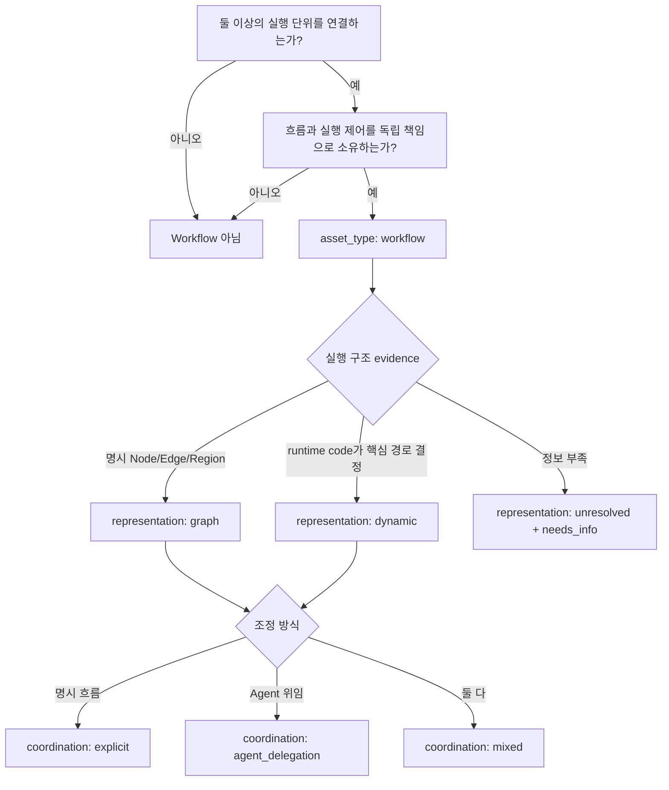

# Workflow 판단 가이드

이 문서는 requirement에서 Workflow 자산 경계를 식별하고 representation과 coordination을 분리해 검토하는 절차다. Workflow 정의와 `workflow_profile`은 [Taxonomy](./taxonomy.md#workflow-profile), Node·Edge·Region은 [Graph IR](./graph-ir.md)가 소유한다.

## Target Contract

Workflow 판단은 세 질문을 분리한다.

1. 독립 Workflow 자산이 존재하는가?
2. 실행 구조를 `graph`, `dynamic`, `unresolved` 중 무엇으로 표현하는가?
3. 조정 방식이 `explicit`, `agent_delegation`, `mixed` 중 무엇인가?

이 답은 `asset_type: workflow`와 `workflow_profile`에 기록한다. 실행 분기·병렬·loop·Human Input은 subtype이 아니라 Graph IR이다.

## 1. Workflow 자산 여부

다음 조건이 함께 성립하는지 본다.

- 둘 이상의 실행 단위를 연결한다.
- 순서, 분기, 병렬, 반복, 입력 대기, 중단·재개 또는 종료를 소유한다.
- 독립 입출력·실패·관찰 경계가 있다.
- 재사용·버전·Owner 또는 승인 단위로 검토할 가치가 있다.

단일 Agent가 여러 Tool을 사용할 뿐 흐름 책임이 독립적이지 않으면 Workflow를 만들지 않는다. Workflow 자산이 아니라면 [후보 탐색 순서](./analysis-guide.md#후보-탐색-순서)로 돌아간다.

## 2. Representation

| 값 | 선택 기준 |
| --- | --- |
| `graph` | 검토 가능한 Node·Edge·route로 실행 구조를 명시할 수 있다. fan-out/fan-in과 종료 조건이 명시된 routed back-edge도 이 범주에 들어갈 수 있다. |
| `dynamic` | 런타임 코드가 반복 횟수·다음 Node 선택·재귀 등 핵심 경로를 결정해 정적 Graph만으로 실행 의미를 고정할 수 없다. |
| `unresolved` | 현재 evidence로 표현 방식을 결정할 수 없다. |

`unresolved`는 정상 완료 상태가 아니다. `status: needs_info`와 구체적인 `missing_information`을 함께 둔다.

## 3. Coordination

| 값 | 선택 기준 |
| --- | --- |
| `explicit` | Workflow Graph 또는 코드가 다음 실행 단위를 명시적으로 정한다. |
| `agent_delegation` | Agent가 상황에 따라 다른 Agent로 위임한다. |
| `mixed` | 명시적 흐름과 Agent 위임을 모두 사용한다. |

Coordination은 Tool Invocation Control을 대체하지 않는다. Tool 사용 여부는 [Tool Invocation Control](./graph-ir.md#tool-invocation-control)에 따라 `workflow` 또는 `agent`로 별도 기록한다.

## 4. ADK 2.x 구성법을 읽는 방법

ADK 2.x에서는 기존 `SequentialAgent`, `ParallelAgent`, `LoopAgent` Template Workflow 계열이 deprecated다. 새 Runtime Handoff는 이 클래스를 선택하거나 생성하지 않고 `google.adk.workflow.Workflow`를 공통 실행 표면으로 사용한다.

- 정적으로 검토 가능한 실행은 Graph Workflow의 Node·Edge·route, fan-out/fan-in, `JoinNode`로 낮춘다.
- 런타임 반복·Node 선택·재귀가 핵심이면 Dynamic Workflow의 dynamic node와 `ctx.run_node()`로 낮춘다.
- `parallel|loop` Region은 Graph 구조와 검토 범위를 설명하며 representation 선택기가 아니다.
- owning Workflow의 `workflow_profile.representation`이 lowering mode를 소유한다. generator가 지원하지 않는 구조라면 다른 mode로 조용히 바꾸지 않고 actionable error로 중단한다.
- collaborative는 coordination evidence로 검토한다.
- `template_ref`는 검토된 구현 패턴·template artifact 후보로 검토한다. deprecated ADK Template Workflow 클래스와 연결하지 않는다.
- framework 버전은 검증 metadata이지 자산 taxonomy가 아니다.

근거는 [ADK Workflow agents](https://adk.dev/agents/workflow-agents/), [Graph Workflow](https://adk.dev/graphs/), [Graph routes](https://adk.dev/graphs/routes/), [Dynamic Workflow](https://adk.dev/graphs/dynamic/)와 설치 패키지의 deprecation 표시를 함께 확인한다.

## 5. Agent Node와 Agent 자산

Workflow 안의 Agent Node는 Agent 자산을 `agent_ref`로 참조한다. Node가 특정 Workflow에 배치됐다는 이유로 Agent의 Owner·Domain·재사용 계약을 복제하거나 바꾸지 않는다.

Agent가 사용할 수 있는 Tool은 `available_tools`에 두며 각 관계는 `invocation_control: agent`다.

## 6. Function Node와 Tool Node

Workflow 내부에서만 의미가 있고 Graph 도달 시 결정적으로 실행되는 단계는 Function Node다. 독립 Tool 계약을 참조해 명시 실행하면 Tool Node다. Agent가 같은 Tool의 사용 여부를 판단하면 Agent의 available Tool 관계다.

상세 기준은 [Function Node, Tool Node, Function Tool 구분](./graph-ir.md#function-node-tool-node-function-tool-구분)을 따른다.

## 7. Subworkflow

Subworkflow Node는 다른 Workflow 자산을 `workflow_ref`로 호출한다. 부모는 검토된 입출력 mapping과 실패 경계를 소유하되 하위 Workflow 내부 Node를 복제하지 않는다.

Graph root의 `workflow_ref`는 현재 Graph 소유 Workflow를 가리킨다. standalone Agent/Tool 해법이면 root `workflow_ref`는 `null`이다.

## 8. 반복·분기·Join

- 분기는 `role: route` Function Node와 `control.kind: condition` Edge로 표현한다.
- 병렬은 `parallel` Region과 `fan_out`/`fan_in` Edge로 표현한다.
- 반복은 `loop` Region과 `loop_back`/`loop_exit` Edge로 표현한다.
- 합류는 `join` Node와 fan-in 계약으로 표현한다.

이 요소를 근거로 새 Workflow subtype이나 제어 Node kind를 만들지 않는다. 특히 `parallel` 또는 `loop` Region이 있다는 사실만으로 representation을 선택하지 않는다.

## 9. Human Input

사람의 입력·승인·선택은 `human_input` Node와 `human_input_contract`로 표현한다. 응답 뒤의 `condition` 또는 `resume` Edge가 다음 실행을 결정한다. 사람은 Invocation Control의 세 번째 값이 아니다.

## 10. 설명용 orchestration 처리 원칙

“orchestration”이라는 표현은 흐름 책임을 설명할 수 있지만 직렬화 subtype이 아니다. 실제 계약은 다음으로 분해한다.

- Workflow 자산 존재 여부
- `workflow_profile.representation`
- `workflow_profile.coordination`
- Graph Node·Edge·Region
- Tool Invocation Control
- runtime contract

## 판단 flowchart

## Current Product contract

`AssetCandidate.asset_type: workflow`은 non-null `workflow_profile`을 요구하고 `binding`, `connection`, `exposure`는 `null`이어야 한다. Graph root `workflow_ref`와 Subworkflow Node `workflow_ref`는 실제 Workflow 후보를 참조해야 한다.

Design Stage Runner는 `af-compose-solution`을 사용해 proposed `analysis-result.json`과 `boundary-design.md`를 만들며 `analysis_reviewed=true` gate가 필요하다. strict Graph와 candidate contract가 유효하지 않으면 proposal apply 또는 scaffold readiness가 성립하지 않는다.

현재 generator는 Graph root의 `workflow_ref`가 가리키는 owning Workflow Profile만 보고 runnable mode를 선택한다. `graph`는 acyclic static Graph Workflow로, `dynamic`은 dynamic node를 포함한 Workflow로 생성한다. `unresolved`, dynamic-only child/edge, routed cycle이 `graph`와 함께 들어오면 mode를 바꾸지 않고 오류로 중단한다. standalone Graph(`workflow_ref: null`)은 static `graph`로 취급한다.

### Source locators

2026-07-19 현재 working tree에서 다음을 재확인했다.

| 행동 | Path | Stable symbol |
| --- | --- | --- |
| Workflow profile과 Graph refs | `packages/web/src/analyzer/types.ts` | `WorkflowProfile`, `GraphIR`, `GraphNode` |
| 자산별 strict 제약 | `packages/web/src/analyzer/targetContract.ts` | `validateWorkflowProfile`, `validateGraph` |
| Graph strict validation | `packages/web/src/analyzer/graphValidation.ts` | `validateGraphIR` |
| Subworkflow insert/prune | `packages/web/src/analyzer/nestedWorkflowInsert.ts` | `insertCatalogWorkflowNode`, `pruneDetachedCatalogWorkflowCandidates` |
| Design Stage Runner | `packages/web/server/stageRunner.ts` | `STAGE_DEFINITIONS.design`, `assertDesignReady` |
| Workflow JSON Schema | `schemas/asset-candidate.schema.json` | `workflowProfile`, `allOf` Workflow 제약 |
| ADK representation 선택 | `scripts/adk-source/graph/dynamic.mjs` | `runnableWorkflowRepresentation`, `assertStaticGraphRepresentationSupported` |
