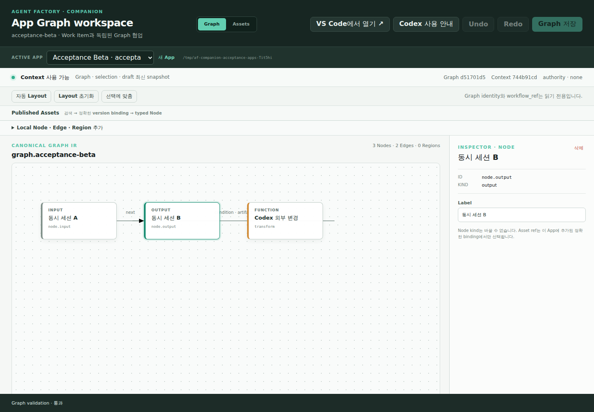

# Companion 사용자 Acceptance 결과 · 2026-08-05

## 실행 범위

- Draft PR: [#22](https://github.com/gttmr/af-companion/pull/22)
- 격리 환경: 임시 `COMPANION_APPLICATIONS_ROOT`와 Registry 복사본
- Client: `codex-cli 0.146.0`, 실제 browser 1440×1000, 독립 MCP process
- 원칙: Tool 결과와 disk readback을 증거로 사용하고, 모델의 최종 요약은
  별도로 판정했다.

## 결과

| 시나리오 | 결과 | 관찰 증거 |
| --- | --- | --- |
| App 생성과 exact Asset binding | 통과 | `acceptance-alpha`를 UI에서 만들고 published Agent·Workflow·Tool의 exact ref/version/hash를 App manifest와 Graph disk readback에서 확인했다. |
| Asset lifecycle | 통과 | 임시 Registry에서 draft create/update, user-evidence review, publish confirmation, exact App binding, immutable published contract, next-version draft, stale Registry revision rejection, deprecate와 새 binding 제외를 확인했다. |
| 두 번째 App과 격리 | 통과 | `acceptance-beta` 활성화 뒤 첫 App의 계속 실행 중인 MCP process가 `app_inactive`를 반환했고, 새 process는 두 번째 App만 읽었다. |
| 재시작 복구 | 통과 | active App, Graph revision, `node.output` selection, pinned position과 Graph/presentation/workspace-state file hash가 재시작 전후 일치했다. 기존 active-App MCP process도 회전된 capability를 다시 읽었다. |
| Codex project MCP load | 통과 | exact App project trust가 없을 때 `companion_graph`가 목록에서 빠지는 것을 재현했다. 전역 설정 변경 없이 일회성 exact-project trust로 실제 Codex get/apply를 실행했다. |
| Codex selection read | 조건부 통과 | Tool은 `acceptance-beta`와 `node.output` selection을 정확히 반환했고, 결과 경로를 `workspace.scope.application_id`와 `workspace.active_selection`으로 명시한 요청의 최종 응답도 정확했다. 경로를 생략한 요청은 모델이 둘 다 `null`로 잘못 요약했다. |
| Codex Node·Edge 추가 | 통과 | 실제 Codex가 get 후 Function Node와 Edge 두 operation을 한 번에 적용해 `APPLIED`와 revision `226a522d…`를 반환했다. Web은 새로고침 없이 3 Nodes·2 Edges와 `Codex 변경 반영됨`을 표시하고 새 Node 위치를 만들었다. |
| Edge Inspector | 통과 | Web에서 endpoint를 `node.codex-step → node.output`, control을 `condition`, condition을 `result.ready`, channel을 `artifact`로 바꾸고 저장했다. |
| Web draft 대 Codex 변경 | 통과 | Web의 output-label draft 1개가 활성화된 상태에서 Codex 변경이 적용됐고 UI가 `저장 전 변경 1개가 대체되었습니다`를 표시했다. |
| 유효한 직접 파일 편집 | 통과 | Graph JSON의 input label을 직접 바꾸자 watcher/reconciliation/SSE가 새 revision과 `외부 파일 변경 반영됨`을 표시했다. |
| 잘못된 JSON과 복구 | 통과 | invalid JSON에서 Context 검증 실패, `Graph write · 차단`, draft/presentation `409`를 확인했다. 원본 복구 뒤 canonical Graph와 write 가능 상태가 돌아왔고 실패한 local edit는 남지 않았다. |
| stale CAS | 통과 | 독립 MCP process 둘이 같은 revision `6c9f495d…`를 읽었다. 첫 apply 뒤 둘째가 `graph_stale`과 current revision을 받았고, fresh get 후 재계산한 apply가 성공했다. |
| 최종 browser 상태 | 통과 | 새 browser session에서 console error 0, Context valid, Graph validation 통과를 확인했다. |

## 발견해 수정한 결함

1. App ID input의 HTML `pattern`이 browser `v` 정규식에서 문법 오류였다.
   browser-valid pattern으로 교체하고 SSR 회귀 test를 추가했다.
2. MCP 설명이 실제 결과 경로와 apply 인자명을 충분히 강조하지 않았다.
   `workspace.*` 결과 경로와 exact `base_graph_revision`/`operations` 계약을
   server instruction과 Tool 설명에 명시하고 list-tools test를 보강했다.
3. Acceptance와 화면 안내에 VS Code Workspace Trust만 있고 Codex의 exact
   project trust 전제는 없었다. 두 신뢰 경계를 분리해 안내했다.

## 남은 증거와 제품 경계

- 이 격리 실행은 실제 Codex CLI의 read/write와 독립 MCP session CAS를
  검증했다. 두 개의 VS Code Codex chat을 동시에 열어 stale을 재현하는
  사람 acceptance는 아직 별도다.
- 자유 형식 변경 요청 한 번은 모델이 apply 인자를 `graph_revision/changes`로
  바꿔 `invalid_arguments`가 됐고, 다른 한 번은 revision을 읽지 못했다고
  판단해 안전하게 write를 생략했다. exact operation 계약을 명시한 요청은
  성공했다. Tool의 fail-closed 동작은 맞지만 prompt 민감도는 남아 있다.
- 이 격리 실행 시점의 생성 App Git repository에는 commit이 없었다. 이후
  같은 Draft PR에서 App Manager가 `main`에 정확히 네 파일의 baseline commit
  하나를 만들고, 후속 변경은 commit하지 않으며 remote를 만들거나 push하지
  않는 정책을 구현했다. 실제 Git integration test가 commit identity/tree와
  실패 시 App 미노출을 검증하므로 이 제품 경계는 닫혔다. 기존 acceptance
  fixture의 과거 상태를 소급해 바꾸지는 않았다.
- GitHub CI가 없으므로 아래 local verification을 원격 check가 재실행하지
  않는다.

## 자동 검증

- `packages/companion`: build와 전체 70 tests 통과
- `packages/companion`: 전체 workspace typecheck 통과
- pinned Codex App Server schema: `codex-cli 0.146.0`, canonical hash 검증 통과
- repository root: `node scripts/validate-artifacts.mjs` 통과
- `git diff --check` 통과

## Screenshot

