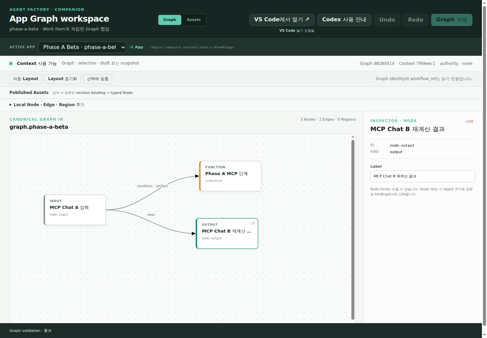

# Companion 사용자 Acceptance 결과 · 2026-08-06

## 판정 범위

- Draft PR: [#22](https://github.com/gttmr/af-companion/pull/22)
- 시작 head: `42e4212588d36287f7479d641162a913f3db2c6f`
- 격리 환경: 임시 `COMPANION_APPLICATIONS_ROOT`와 Registry 복사본
- Browser: Chrome `147.0.7727.55`, 1440×1000, Chrome DevTools `8899`
- Codex CLI: `0.146.0`, isolated `CODEX_HOME`, exact App project config
- VS Code: `1.131.0`, WSL `Ubuntu-24.04`, `openai.chatgpt@26.727.40816`; launcher와
  workspace/config 경계만 확인하고 AI chat은 사용자 결정으로 생략
- MCP client: Codex CLI project load와 독립 local MCP process를 별도 판정

전체 Phase A 판정은 **BLOCKED / INCOMPLETE**다. Browser, Registry, App, local MCP와
restart 항목, Codex CLI direct model chat과 외부 egress 차단은 현재 실행에서 통과했다.
사용자는 self-hosted provider를 설정할 수 없는 VS Code extension의 current-run AI chat을
생략하고 Codex CLI만 사용하도록 허용했다. 그러나 Codex CLI turn이 Companion MCP Tool을
model-mediated로 호출하지 못했으므로 full acceptance는 통과하지 않았다. 따라서 PR #22는
ready/merge 대상이 아니다.

Session 2 model preflight는 ignored local configuration의 승인된 Tailscale direct
OpenAI-compatible `/v1` transport에서만 실행했다. Private endpoint bytes는 이 문서,
repository, managed App, screenshot 또는 Git evidence에 저장하지 않았다.

## Preparation과 foundation failure

다음 command를 source write 전에 실행했다.

```bash
node .agent-factory/runtime/session2-model-preflight.mjs
```

결과는 `ready: true`, provider `self_hosted_vllm_over_tailscale_direct`, model
`hosted_vllm/qwen3.6-27b-128k`, reported context `131072`, chat completion
`passed`, cloud fallback `false`였다. 이 판정은 **self-hosted-27B Session 2
acceptance**이며 `small-model PASS`가 아니다.

PR #22에는 GitHub status check가 하나도 없었고 repository에 `.github/**`가 없었다.
`gh pr checks 22`는 `no checks reported`로 exit 1이었다. product source의 baseline
`typecheck`, 70 tests, build, root artifact validator는 모두 통과했으므로 failure를
GitHub verification foundation 부재로 국소화했다.

최소 수정은 pull request와 `main` push에서 Companion `npm ci`, typecheck, test, build와
root artifact validator를 실행하는 `Companion foundation` workflow 추가로 제한했다.
수동 acceptance에서 별도로 발견한 capability temp 문제에는 partial source fix를 섞지 않고
아래 남은 위험으로 기록했다.

첫 workflow 실행 [run `31062409540`](https://github.com/gttmr/af-companion/actions/runs/31062409540),
head `b7cd9ef5822a6c279f3b4f942544adc15d0b65ee`, job `92492928113`은 `Test Companion`에서
실패했다. `each readiness request is aborted within the remaining deadline` test가
`cancelledByParent`와 `Promise resolution is still pending but the event loop has already resolved`를
보고했고 build와 artifact validator는 skip됐다. 실패를 재현한 뒤 test double이
`AbortSignal.timeout()`의 unref timer만 기다려 Node 22 runner의 event loop가 먼저 종료되는
것으로 국소화했다. Production source는 바꾸지 않고
`8fd2d4507e02f9a9d3cff5b061ac234cd23414df`에서 fake request에 ref 상태인 1초 fail-safe를
추가하고 abort 때 clear했다. Abort가 동작하지 않으면 기존 `<250ms` assertion이 그대로
실패한다.

수정한 launcher safety test는 local에서 20회 연속 통과했고 full local suite도 70/70
통과했다. Source-fix [run `31062612139`](https://github.com/gttmr/af-companion/actions/runs/31062612139),
head `8fd2d4507e02f9a9d3cff5b061ac234cd23414df`, job `92493525855`는 1분 26초에 install,
typecheck, test, build와 validator를 모두 통과했다. 이 run은 `actions/checkout@v4`와
`actions/setup-node@v4`의 Node 20 action-runtime deprecation annotation을 남겼다. 2026-08-06에
official release API로 각각 최신 `v7.0.1`, `v7.0.0`을 확인한 뒤 workflow의 두 action ref만
`@v7`로 올렸다. Hygiene commit `fd12ba86c3fb889537e117bfaa41b245f008afae`의
[run `31062757202`](https://github.com/gttmr/af-companion/actions/runs/31062757202), job
`92493959495`는 1분 31초에 모든 step을 통과했고 같은 deprecation annotation이 없었다.
GitHub CI foundation은 통과했지만 model-mediated Companion MCP blocker 때문에 전체 Phase A
판정은 계속 BLOCKED다.

## Codex CLI current-run 대체 검증

사용자의 Session 2 전용 결정에 따라 extension AI chat 대신 Codex CLI `0.146.0`을 exact
`phase-a-beta` App root에서 실행했다. Isolated `CODEX_HOME`과 project trust를 사용한
`codex doctor`/`codex mcp` 결과는 project config load, required `companion_graph` server와
exact Tool `companion_get_graph_workspace`, `companion_apply_graph_changes` 두 개를 확인했다.

승인된 direct Tailscale model IP와 IPv4 loopback만 허용하고 그 밖의 IPv4/IPv6를 거절하는
named system-level transient unit에서 no-Tool CLI turn을 실행했다. Unit
`af-session2-phase-a-cli-journal-20260806-01.service`, invocation
`5eba38d90c404a0c998a61347007ec09`는 2026-08-06 10:16:50 KST에 시작해 exit 0이었다.
`systemctl show`는 deny `0.0.0.0/0 ::/0`, allow `<approved-tailscale-model-ip>/32 127.0.0.0/8`을
보고했다. Stdout을 terminal로 pipe하지 않아 실제로 보존된 journal marker는 private model
`/models` HTTP 200, 외부 IP curl exit 28,
`codex_exit=0`, exact response `SESSION2_CODEX_DIRECT_OK`였다. CLI JSONL SHA-256은
`cbc231d99461d99f0f2950b372f871e5c176699fdb525a5b079a4bea843472f3`, last-message SHA-256은
`cb09754319df31c656b5ba7856ed7ed8da387c38bae7e65f7a9cc239ca1c9850`이다. Cloud model,
Gemini fallback, deploy, publish 또는 cloud observability는 호출하지 않았다.

재현에 사용한 network policy command shape는 다음과 같고 endpoint와 key 값은 ignored local
environment에서만 읽었다.

```bash
sudo systemd-run --unit=af-session2-phase-a-cli-journal-20260806-01 \
  --property=RemainAfterExit=yes \
  --property=IPAddressDeny=any \
  --property=IPAddressAllow=<approved-tailscale-model-ip>/32 \
  --property=IPAddressAllow=127.0.0.0/8 \
  <sanitized-codex-cli-proof-command>
```

MCP get은 두 Codex-supported 표현으로 별도 시도했다.

- Direct mode에서 Codex는 Companion Tool을 Responses nested namespace로 보냈지만 model은
  namespace child function을 호출하지 않고 generic MCP resource method를 제안했다.
- Official Codex `rust-v0.146.0` source가 검증하는 code-mode 경로에 맞춰 isolated model
  metadata를 `code_mode_only`로 선택했다. Codex source에서 MCP는
  `tools.mcp__companion_graph__companion_get_graph_workspace`로 노출되지만 entrypoint `exec`는
  freeform/custom Tool이다. Model은 자신의 visible Tool set에 `wait`와 `request_user_input`만 있고
  `exec`가 없다고 응답했다. 이 응답만으로 Tool이 손실된 정확한 layer를 확정하지 않는다.

Named code-mode unit `af-session2-phase-a-cli-mcp-20260806-01.service`, invocation
`0ced2ec61a5149d581dfeabe39c9be8f`은 2026-08-06 10:06:02 KST에 같은 deny/allow policy로
시작해 exit 0이었다. `/models`는 200, 외부 IP는 curl exit 28이었고 model은 MCP를 호출하지
못했다고 응답했다. CLI JSONL SHA-256은
`7fdb059ec8580ea6187a7a474e7a04efd895bd1d45648ab8154c6565677c1499`, last-message SHA-256은
`6fc84537bb2e62c2a3a396d172aa6c4aa95f99467b709a3d138f8c876c593e23`이다. 실행 전후 Graph
SHA-256은 `7f86453a78fe62b782599b74c6ab65719caf3ec332840f33638fef33cc59f195`로 같았다.

두 Tool 표현의 final status는 **BLOCKED**, Companion Graph mutation은 0이었다. Codex CLI direct
chat PASS, project MCP discovery PASS와 독립 local MCP get/apply/stale PASS는 model-mediated MCP
호출 PASS가 아니다. 관찰된 compatibility gap의 root cause는 아직 격리하지 못했고 PR #22 product
source의 current foundation failure로 국소화되지 않았으므로 speculative adapter를 추가하지 않았다.
Direct namespace request envelope를 확인하기 위한 localhost diagnostic proxy capture는 acceptance
transport가 아니며 결과 산정에서 제외했다. 최종 PASS/blocked evidence의 model call은 approved
endpoint를 직접 사용했다.

네트워크 격리 준비 중 user-scope `systemd-run --user` 정책이 이 host에서 egress를 강제하지
않는다는 사실을 확인하기 전에 실행한 외부 IP probe 한 번은 예상과 달리 도달했다. 이 실행은
acceptance에서 제외했다. 최종 direct chat, named code-mode attempt와 egress proof는 실제 차단을
확인한 system-level transient unit을 사용했다. 이 incident를 외부 request 0으로 숨기지 않는다.

## 실제 browser와 local MCP 결과

아래 항목은 current operator observation이며, private endpoint와 token을 제거한 exact
status/revision/hash transcript는
[Phase A sanitized evidence](./evidence/phase-a-2026-08-06-evidence.json)에 보존했다.

| 시나리오 | 결과 | 현재 실행 증거 |
| --- | --- | --- |
| App 생성과 local Git baseline | 통과 | UI에서 `phase-a-alpha`를 만들었다. branch `main`, baseline commit 1개, 제목 `chore: initialize Companion app workspace`, 작성자 `Agent Factory Companion <companion@agent-factory.local>`, remote 없음, 최초 status clean과 네 tracked file을 확인했다. |
| exact Asset binding | 통과 | published Agent·Tool·Workflow를 각각 binding하고 typed Node를 추가했다. Graph save 뒤 commit 수는 1이고 exact ref/version/hash가 App binding과 Graph disk readback에 일치했다. |
| Asset lifecycle | 통과 | 임시 Registry에서 contract validation failure `422`를 먼저 확인한 뒤 draft create/update, user-evidence review, incomplete publish의 browser-side write 차단, 세 confirmation을 포함한 immutable publish, exact binding, next-version draft를 확인했다. |
| Registry stale CAS | 통과 | 같은 revision의 첫 update는 200, 늦은 update와 stale UI review는 `409 registry_revision_conflict`였다. UI는 적용하지 않고 최신 version을 다시 읽었다. |
| Deprecated 제외 | 통과 | 명시적 user Decision으로 published v1을 deprecated 처리했다. Alpha의 기존 exact binding은 보존됐고 새 Beta App의 published search에는 v1과 draft v2가 모두 나타나지 않았다. |
| App 전환과 격리 | 통과 | UI에서 `phase-a-beta`를 만들자 Alpha에 계속 연결된 MCP process의 다음 get이 `app_inactive`를 반환했다. Beta의 새 process는 application ID, selection과 Graph만 읽었다. |
| MCP Tool contract와 selection | 통과 | local MCP list는 `companion_get_graph_workspace`, `companion_apply_graph_changes` 두 Tool만 반환했다. Web에서 선택한 `node.output`을 get의 `workspace.active_selection`에서 정확히 읽었다. |
| MCP Node·Edge와 live Web | 통과 | 첫 invalid Function add는 missing `role`로 `422 graph_contract_violation`을 재현했다. fresh get 후 `role: transform`으로 재계산한 add Node+Edge는 `APPLIED`였고 Web은 새로고침 없이 3 Nodes·2 Edges, 자동 위치와 `Codex 변경 반영됨`을 표시했다. |
| Edge Inspector | 통과 | Web에서 endpoint를 `node.input → node.phase-a-step`, control을 `condition`, condition을 `phase_a.ready`, default를 false, channel을 `artifact`로 바꾸고 저장했다. |
| Web draft 대 MCP write | 통과 | output-label Web draft 1개가 활성 상태일 때 fresh get→apply를 실행했다. MCP 결과가 canonical이 됐고 UI는 `저장 전 변경 1개가 대체되었습니다`를 표시했다. |
| 직접 파일 fallback | 통과 | Graph JSON의 input label을 유효하게 직접 수정하자 watcher/reconciliation/SSE가 새 revision과 `외부 파일 변경 반영됨`을 표시했다. |
| invalid JSON fail-closed | 통과 | invalid JSON 동안 Context 검증 실패와 `Graph write · 차단`, draft/presentation `409`, MCP `409 invalid_external_source`를 확인했다. 원본 복구 뒤 같은 canonical revision과 write 가능 상태가 돌아왔고 실패한 label은 남지 않았다. |
| stale Graph CAS | 통과 | 독립 MCP client 둘이 revision `a03d340c…f88`을 읽었다. A apply 뒤 B old-revision apply는 `412 graph_stale`과 current revision을 반환했다. B가 fresh get 후 재계산한 apply는 `APPLIED`로 revision `d8280414…d8ee`가 됐다. |
| restart recovery | 통과 | active App `phase-a-beta`, Graph revision `d8280414…d8ee`, `node.output` selection, position `(550,250)`과 `pinned: true`가 복구됐다. root state, Graph, presentation과 workspace-state hashes가 restart 전후 일치했고 기존 Beta MCP process도 회전된 capability를 hot-read했다. |
| local App Git 경계 | 통과 | Beta는 baseline commit 1개와 remote 없음이 유지됐다. stale capability temp를 제거한 뒤 status에는 canonical `companion-graph.json` 변경만 남았다. |

## VS Code launcher 경계

실제 browser에서 `VS Code에서 열기 ↗`를 눌러 POST
`/api/companion/editor/launch-vscode`의 `202`와 `VS Code 열기 요청됨`을 확인했다.
`code --status`는 새 window를 WSL remote의 exact root
`/tmp/af-companion-session2-phase-a.Wfnw0U/apps/phase-a-beta`로 표시했다. project-local
`.codex/config.toml`은 exact root를 cwd와 `--project-root`로 사용하며 두 MCP Tool만
enable하고 write approval mode를 `writes`로 유지했다.

2026-08-05의 실제 extension chat 두 개에 의한 get/apply, write approval과 stale retry
evidence는 [전일 Acceptance 결과](./ACCEPTANCE-RESULTS-2026-08-05.md)에 보존돼 있다.
이번 실행에서는 installed extension에 approved self-hosted provider setting이 없어 사용자
결정에 따라 새 extension AI chat을 호출하지 않았다. 이는 current-run gate에서 허용된 생략이며
전일 cloud extension evidence를 Session 2 PASS로 재사용하지 않는다. 대체 client인 Codex CLI의
model-mediated MCP 실패가 위에 별도 blocker로 남는다.

## Browser DOM·console·network

재시작 뒤 fresh reload에서 다음을 Chrome DevTools Protocol로 수집했다.

- DOM: active `phase-a-beta`, 3 Nodes·2 Edges, Context 사용 가능, Graph validation 통과,
  selected/pinned `node.output`
- Runtime exception 0, console error 0, Log error/warning 0
- network loading failure 0, HTTP 4xx/5xx 0
- page resource origin은 `http://127.0.0.1:8890` 하나이며 external resource 0



Screenshot은 1440×1000 PNG이며 SHA-256은
`7fba8c0b81da00be24b73af912cf941dc5eeeb3f689d948478b56622cd7f0961`이다.

## Session 1 handoff audit와 남은 위험

- Session 1 source `d486c83d6a7599354fb859923f64fa9126ba84cc`와 merge
  `614743de98744d7301676408b1d1f13893ce4562`는 현재 head의 ancestor다.
- PR #23 merged evidence, bundle `2.0.0-adk2.4-session1`과 digest
  `8bafba76b99095265b927b696eddbd6ea251c68039ff356a933efdb75db8350c`,
  accepted agents-cli/Google Skill digests, exact ADK/MCP/A2A versions, 70-row inventory,
  64 experiments와 completion audit를 확인했다.
- merged Session 1 artifact에는 literal `required_integration` field나 named set이 없다.
  CP-001–CP-005 compound set과 Session 2 E2 minimum list는 존재하지만 둘을 임의로
  같은 handoff artifact라고 재정의하지 않았다. Phase B는 이 계약 gap을 명시적으로
  해소하기 전 representative set을 추측해서는 안 된다.
- Session 1 manifest, AF Skill instruction과 Session 1 evidence는 변경하지 않았다.
- abrupt server stop 중 기존 App에 mode 0600 capability atomic-write temp가 남아
  `git status`에 나타나는 것을 재현했다. Disposable App에서는 stale/rotated token 파일을
  수동 제거했지만 기존 App 안전 remediation은 구현하지 않았다. `git add -A` 전에 이런
  temp를 검사해야 하며 별도 security follow-up이 필요하다.
- [Independent review](./evidence/phase-a-2026-08-06-independent-review.md)는 최초 current-run
  VS Code gap을 High로 판정했다. 사용자의 이후 결정으로 extension 자체는 필수조건에서
  제외됐지만, replacement Codex CLI의 model-mediated MCP compatibility gap이 같은 acceptance
  경계의 open blocker로 남는다. Capability temp의 기존-App remediation도 별도 위험이다.
- 새 GitHub workflow의 실제 check 결과가 통과하더라도 CLI MCP blocker가 해소되기 전 PR #22를
  ready 또는 merge하지 않는다.

## 검증 command

현재 source set에서 다음 local gate가 모두 통과했다.

- `npm run typecheck`: exit 0
- `npm run test`: 70 tests, 70 pass, 0 fail
- `npm run build`: exit 0, Vite production build 포함
- `node scripts/validate-artifacts.mjs`: `Artifact validation OK`
- `git diff --check`: exit 0
- sanitized evidence JSON parse: 통과
- criterion/evidence amendment commit `b7cd9ef5822a6c279f3b4f942544adc15d0b65ee`의 Markdown
  6개에서 relative link 29개 검사: 통과
- `node --test test/dev-launcher-safety.test.mjs` 20회 연속 실행: 20/20 통과
- GitHub source-fix run `31062612139`: 1분 26초, 모든 step 통과
- GitHub current-actions run `31062757202`: 1분 31초, 모든 step 통과, deprecation annotation 0

실행 command는 다음과 같다. 이 evidence-only final head의 GitHub check는 PR description에
별도로 기록한다.

```bash
cd packages/companion
npm run typecheck
npm run test
npm run build
for i in $(seq 1 20); do node --test test/dev-launcher-safety.test.mjs || exit 1; done
cd ../..
node scripts/validate-artifacts.mjs
git diff --check
```
