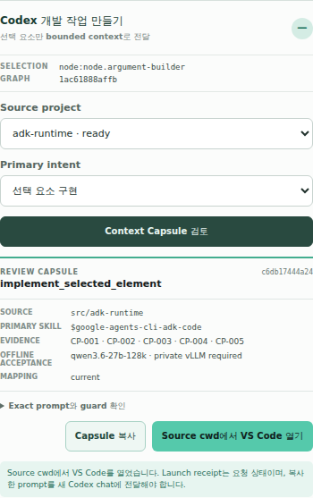

# Session 2 Phase B–E acceptance evidence

Date: 2026-08-06 (Asia/Seoul)

## Verdict

| Surface | Result | Meaning |
| --- | --- | --- |
| Companion source, contracts, deterministic runtime, local browser | **PASS** | The bounded development-context flow and offline-first ADK implementation are reviewable and deterministic. |
| Current llama.cpp compatibility-path Qwen diagnostic | **FAIL** | The run reached E3 and exposed ADK 2.4 timeout-type loss. It is retained as diagnostics and is not converted into a target PASS. |
| Target bank private-vLLM Qwen acceptance | **UNVERIFIED** | The real Internet-disconnected vLLM environment was unavailable in this development session. Only that environment can own the final self-hosted-27B Session 2 acceptance verdict. |

No successful Gemini or compatibility-bridge run is counted as target acceptance. The generated runtime has no Gemini or proxy dependency, and no test-only timeout wrapper remains to force the Qwen path through E3.

## Product model and transport contract

- required provider: `self_hosted_qwen_vllm`
- exact model ID: `qwen3.6-27b-128k`
- input context: `131072`
- transport class: private OpenAI-compatible vLLM `/v1`
- endpoint/key source: ignored local configuration through `AF_QWEN_BASE_URL` and `AF_QWEN_API_KEY`
- fallback: `false`
- network policy: private model transport and required loopback only; Internet egress, cloud model fallback, deploy, publish, and cloud observability are excluded

The endpoint and key values are absent from App, Graph, source, capsule, screenshot, and this evidence. Only their environment-variable names are locked. Endpoint validation fails closed for public hosts, URL-embedded credentials, query/fragment data, and paths other than `/v1`; readiness requires a non-empty key and sends it only as Bearer authorization to the private `/v1/models` probe. The accepted private forms are loopback, RFC1918, Tailscale CGNAT, and explicitly internal hostnames.

The inventory shape follows vLLM's current
[`OpenAIModelRegistry.show_available_models`](https://github.com/vllm-project/vllm/blob/main/vllm/entrypoints/openai/models/serving.py),
which emits `max_model_len` on the base-model card. Missing or non-`131072` values fail readiness instead of falling back to llama-specific metadata.

Gemini was used only as a development accelerator and independent read-only reviewer. It is not emitted in the model lock, Development Context Capsule, generated source, configuration example, or browser UI.

## Companion, Graph, mapping, and local Git proof

- integration base: `f3ef4992235f08d656c6aa0237788ef852111e25` (merged PR #22 and Session 1)
- generated App: ignored local `session2-adk-bank`
- App source HEAD: `3f34fa1d2f42cc682153c5e15238bd1c1a1abc30`
- Graph revision: `1ac61888affba92b6fdddf1fe586ca9d9417f5149f62902cf06d0fb2fe99defe`
- Graph inventory: 17 nodes, 21 edges, 2 regions
- App Asset revision: `a384f3cb3b66fbccd9cdaa7b8c52890adbbb1904e1917c48fc31e587289bcf4a`
- exact Registry bindings: 11
- implementation mapping revision: `4f349097733a8dcbf9b43703069e2206d56ae71ebc810e7fe4827ce759f8ab75`
- mappings: 8/8 `current`, all with `git_result_commit` equal to App HEAD
- representative active selection: `node.argument-builder`
- current capsule ID: `c6db17444a243b7fdee72f8728c25cc22894589e34111bdc6f437df844cea8ba`

The eight mappings cover `edge.guard-retry`, `node.analysis-route`, `node.argument-builder`, `node.final-review`, `node.objective-classifier`, `node.workflow-handoff`, `region.analysis-parallel`, and `region.recommendation-loop`.

The App commit chain preserves scaffold, composition, capability, failure-reproduction, and final simplification steps:

```text
3e9210a initialize Companion app workspace
265fdae declare ADK source project
af6667a scaffold local ADK runtime
98a7b95 compose representative Companion graph
1652b3f establish offline ADK workflow runtime
8f31074 integrate representative offline ADK capabilities
7a864f4 distinguish Agent-owned tool selection
803c1a1 make Qwen acceptance directly executable
797337d run coordinator through its Workflow contract
b239b9a validate coordinator output after Qwen generation
5baac04 run AgentTool children in ADK root mode
e1062ef normalize Qwen fenced coordinator JSON
db9fb97 fail on A2A error Events
430062e preserve A2A timeout type in the diagnostic experiment
cc8ad41 stabilize the Qwen coordinator contract
4f73723 target the private vLLM runtime and remove the test-only timeout workaround
157dda4 require the exact vLLM model inventory contract
3f34fa1 lock the private vLLM Bearer-key source without storing its value
```

The App worktree intentionally has only `.agent-factory/companion-implementation.json` modified. Committing a sidecar whose entries must name the current source HEAD would immediately advance HEAD and make those entries stale; the current sidecar therefore remains local evidence with every mapping pointing to the clean source commit `3f34fa1`.

No Asset Registry write was made. The A2A provider remains project-local because none of the exact published Agent bindings grants A2A exposure. Source writes remain in local App Git while Graph and mapping mutations remain revision-checked Companion operations.

## Weak-model assistance retained in product code

The implementation keeps only aids that are useful with a weaker model and do not depend on the development serving stack:

- bounded, selection-specific capsules instead of a repository-wide prompt;
- exact source roots, Graph revision, Asset hashes, mapping state, and unsupported guards in each task;
- concise prompts that require all output keys and `temperature=0`;
- two typed `AgentTool` children with exact one-call contracts and a deterministic parent aggregator;
- strict Pydantic validation after generation, with no missing-field defaults;
- normalization of one exact fenced JSON payload while rejecting explanatory prose;
- bounded Workflow review attempts, explicit parallel join, typed HITL replay IDs, and typed A2A failures;
- no model retry, fallback, cloud path, or invented unsupported API.
- exact vLLM `/v1/models` inventory: served ID plus `max_model_len: 131072`; llama.cpp-only `meta.n_ctx` is not accepted.

These are target-serving-independent contract controls. llama.cpp developer-message merging, namespaced-Tool translation, and proxy behavior are deliberately absent from product source.

## Deterministic runtime verification

Approved Python:

```text
/home/ilmaswsl/work/af-companion/.agent-factory/runtime/.venv/bin/python
```

Installed exact versions:

```text
agents-cli 1.2.1
google-adk 2.4.0
mcp 1.28.1
a2a-sdk 0.3.26
litellm 1.93.0
fastapi 0.139.2
uvicorn 0.51.0
pytest 9.1.1
httpx 0.28.1
```

Commands and results from `src/adk-runtime`:

```text
/home/ilmaswsl/work/af-companion/.agent-factory/runtime/.venv/bin/python -m pytest tests/unit tests/integration -q
=> 47 passed, 14 warnings in 1.90s

PYTHONPYCACHEPREFIX=/tmp/session2-adk-pycache-final \
  /home/ilmaswsl/work/af-companion/.agent-factory/runtime/.venv/bin/python -m compileall -q app tests
=> COMPILEALL_OK

/home/ilmaswsl/work/af-companion/.agent-factory/runtime/.venv/bin/python tests/eval/run_local_eval.py
=> local_typed_contract 2/2 passed
```

The warnings are ADK/Starlette experimental or deprecation warnings, including resumability, `RemoteA2aAgent`, `AgentCardBuilder`, `A2aAgentExecutor`, and in-memory credential service. `agents-cli lint` is not claimed: agents-cli 1.2.1 invokes `uv sync --extra lint`, but this accepted scaffold has no `lint` extra. No dependency was added solely to manufacture that check.

## Companion verification

Commands and results from `packages/companion` unless noted:

```text
npm run typecheck
=> PASS

npm test
=> PASS: graph-domain 4, contracts 3, graph-control-server 15,
   mcp-plane 2, app-server-client 28, web 20, launcher 4, integration 3
   (79 tests total)

npm run build
=> PASS: TypeScript builds and Vite production bundle

# repository root
node scripts/validate-artifacts.mjs
=> Artifact validation OK

git diff --check
=> PASS
```

The model-readiness regression explicitly accepts only the exact vLLM model ID plus `max_model_len: 131072`, and rejects a missing or smaller context value as `contract_mismatch`.

## Qwen and constrained-egress diagnostic

The last llama.cpp-path diagnostic, on App commit `4f73723`, ran as:

```text
af-session2-qwen-final-diagnostic-20260806-11.service
/home/ilmaswsl/work/af-companion/.agent-factory/runtime/.venv/bin/python tests/integration/qwen_acceptance.py
```

The system bridge cgroup could reach only loopback and its private upstream, and the acceptance client could reach only loopback. A separate negative probe returned `EXTERNAL_EGRESS_DENIED`.

The run completed E1 structural Workflow/Subworkflow checks and E2 exact coordinator Tool behavior, then exercised the E3 local A2A success and unavailable-provider paths. The hanging-provider case was flattened by ADK 2.4 into an error without the original timeout subtype, producing:

```text
unexpected timeout classification: status='remote_failure'
```

This is a diagnostic **FAIL**. An earlier experiment that wrapped the call in a test-only outer deadline was discarded, and that wrapper is absent from `4f73723`. App commit `157dda4` then replaced the llama-specific `meta.n_ctx` inventory read with vLLM's exact `max_model_len`; the llama diagnostic was not rerun or relabeled after that target correction. The target private-vLLM run remains **UNVERIFIED** until the same script runs in the bank-like vLLM environment with Internet egress denied.

## Browser evidence

Chrome DevTools availability was proven through `http://127.0.0.1:8899/json/version`; the Companion screen was then exercised at `http://127.0.0.1:8890/`.

For this deterministic UX check only, a loopback fixture returned the exact vLLM `/v1/models` inventory (`qwen3.6-27b-128k`, `max_model_len: 131072`). It did not implement generation and is not model-performance or Tool-call evidence.

- visible model label: `qwen3.6-27b-128k · private vLLM required`
- visible mapping status: current
- generated capsule: active selection `node.argument-builder`
- prompt contains only the endpoint/key environment-variable names, not either value
- DOM contains no Gemini, proxy, or persisted model URL
- console: 0 errors, 0 warnings
- network: same-origin Companion requests only; development-context POST `200`, VS Code launch POST `202`
- launch contract: source cwd, manual prompt copy, receipt status `requested`



Screenshot SHA-256: `8ea5525e7b162a3d07c10c70ae7a477111b0776ffad4347515a5695595f3eddd`

## Independent review

A read-only independent review used Gemini CLI `gemini-3.1-flash-lite` in plan mode. The full read at `/tmp/session2-adk-runtime-review-20260806-07` first confirmed all nine requested Companion/App files were readable and reported `NO ACTIONABLE FINDINGS`. After Bearer readiness was added, a final delta review against exact current Companion source plus `/tmp/session2-adk-runtime-review-20260806-08` again reported `NO ACTIONABLE FINDINGS` and specifically checked authentication, non-persistence, model/context lock, authority separation, and fail-closed behavior. An earlier attempt that could not read the ignored App source was discarded. These cloud calls were development-only and are not runtime or acceptance dependencies.

The reviews retain environment enforcement and ADK 2.4 `RemoteA2aAgent` timeout subtype loss as concrete remaining risks: OS/container egress policy must enforce the network claim, operators must keep env values out of logs/history/process dumps, and E3 still loses the original timeout subtype. The project audit additionally retains the private-endpoint hostname heuristic as an integration risk when a bank uses a nonstandard internal DNS suffix or segmented private addressing.

## Unsupported items and remaining risk

- `B12-live-workflow-streaming`: no exact ADK 2.4 live/bidi Workflow implementation is claimed.
- `F04-public-python-cancellation`: no public Python Runner cancellation API is invented.
- `G06-workflow-a2a-exposure`: A2A exposure remains Agent-only.
- `H07-unsupported-api-refusal`: public `END`, cancellation, and compaction exports are not fabricated.
- The merged Session 1 artifact has no literal named `required_integration` set; the representative set used here is explicitly the eight current mappings and eleven exact Asset bindings, not a rewritten Session 1 artifact.
- Target private-vLLM Qwen behavior, latency, Tool-call reliability, 128k pressure, and E1–E3 completion remain unverified in this development environment.
- ADK resumability and A2A integration are experimental in 2.4.0.
- Persistent production stores, TLS/auth termination, deployment, publishing, cloud observability, Internet retrieval, and Workflow A2A exposure remain out of scope.
- The local App and mapping sidecar are evidence artifacts, not published cloud state.

This evidence supports a Draft PR review gate only. It does not authorize Draft removal, publication, deployment, or merge.
